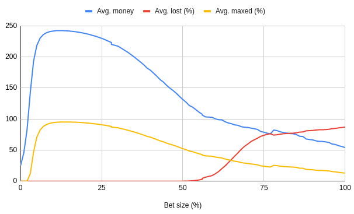

# Kelly Criterion simulation

A simulation for the example given by the Wikipedia Kelly criterion article [^1].

A player starts with 25 points. The chance of winning a bet is 60%. The maximum number of bets are 300. The maximum score a player can have is 250, and once reached the game is over and the player has won. If the player's score reaches 0 or below, the game is over and the player loses.

At the start a player picks a fixed proportion or percentage he uses when he bets and uses that same proportion for all the bets of the game.

A player bets a proportion of his score. If the player wins the bet he gets double the score back. If the player loses the bet he loses the score he bet.

This simulation plays a lot of games for various players with different betting proportions and measures how often each player loses the game, gains the maximum score, what score they average out on depending on bet proportion.



## Notes

Running:

```sh
cargo run 1000000
```

takes about 990 seconds, whereas running:

```sh
cargo run --release 1000000
```
takes about 9 seconds, which is roughly about 100x faster, on a AMD Ryzen 7 3700X 8-Core processor (16 threads).

[^1]: <[https://en.wikipedia.org/wiki/Kelly_criterion#Example](https://en.wikipedia.org/wiki/Kelly_criterion#Betting_example_%E2%80%93_behavioural_experiment)>
